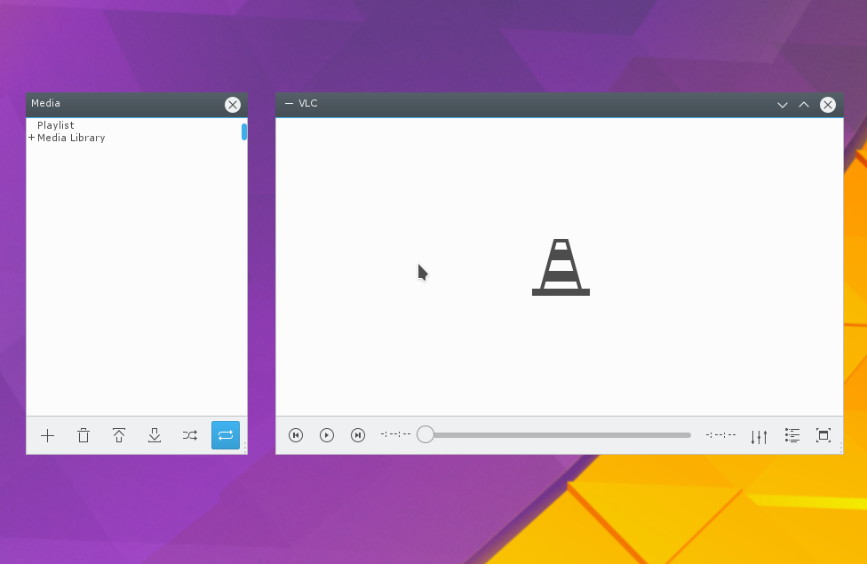

# Breeze-VLC
  A Breeze skin for [VLC](http://www.videolan.org/vlc/).
  Breeze VLC is a lightweight, modern skin for better integration
  with the KDE Plasma 5 desktop environment.


# Install

``` bash
git clone https://github.com/brdjns/breeze-vlc.git ;\
cd breeze-vlc ;\
sudo make install
```
# Licence
GNU Public Licence, version 3

# Bugs
Probably lots. Open an issue.

# Contribute
Contributions are welcome.
